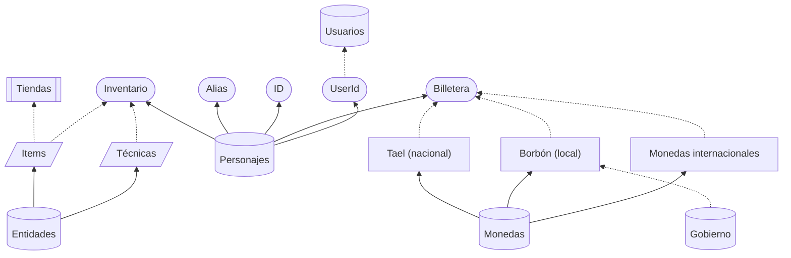

```mermaid
flowchart BT

Ent[("Entidades")]
	It[/ "Items" /]
		Tien[["Tiendas"]]
	Tec[/ "Técnicas" /]
	
PJ[("Personajes")]
	Inv(["Inventario"])
	Alias(["Alias"])
	ID(["ID"])
	UId(["UserId"])
	Bil(["Billetera"])

Users[("Usuarios")]

Gob[("Gobierno")]

Mon[("Monedas")]
	Tael["Tael (nacional)"]
	Bor["Borbón (local)"]
	Mint["Monedas internacionales"]


Ent --> It
	It -.-> Tien
Ent --> Tec

PJ --> Inv
	It -.-> Inv
	Tec -.-> Inv
PJ --> Alias
PJ --> ID
PJ --> Bil
PJ --> UId
	UId -.-> Users

Mon --> Tael
	Tael -.-> Bil
Mon --> Bor
	Bor -.-> Bil
Mon --> Mint
	Mint -.-> Bil
	
Gob -.-> Bor
```

